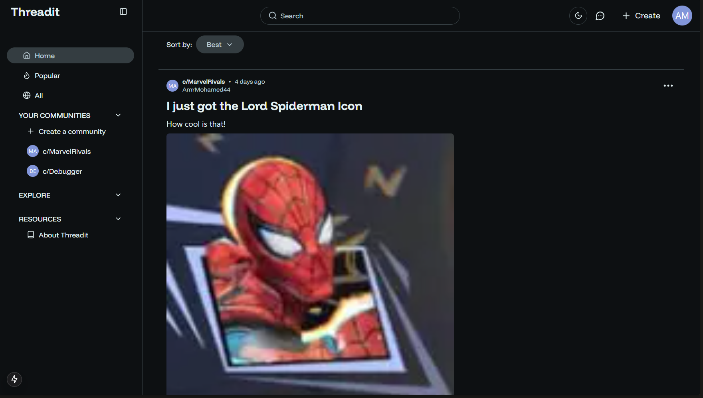

# Threadit

 

A full-stack Reddit clone built with Node.js, GraphQL, Apollo for the backend, and Next.js for the frontend and Typescript on both.



## 📋 Table of Contents

- [Threadit](#threadit)
  - [📋 Table of Contents](#-table-of-contents)
  - [🚀 Project Overview](#-project-overview)
  - [📝 Why I built this?](#-why-i-built-this)
  - [🏗️ Architecture](#️-architecture)
    - [Frontend](#frontend)
  - [✨ Features](#-features)
    - [Prerequisites](#prerequisites)
    - [Frontend Setup](#frontend-setup)
  - [🚀 Deployment](#-deployment)
  - [💻 Browser Compatibility](#-browser-compatibility)
  - [⚡ Performance](#-performance)
  - [🤝 Contributing](#-contributing)
  - [📬 Contact](#-contact)
  - [📝 License](#-license)

## 🚀 Project Overview

This is the frontend repository of a full-stack, fully functional Reddit clone with many features such as user authentication, CRUD operations on posts, comments and communities, and more.

## 📝 Why I built this?

I wanted to create a full-stack project using technologies that I am not familiar with and learn about them, such as GraphQL and Websockets. I also wanted to explore the capabilities of the technologies I was using, and see how they could be used to build a real-world application.

## 🏗️ Architecture

-**Tech Stack**:

- React v19 and Next.js v15 using the App Router
- Typescript v5 for type safety
- TailwindCSS v3.4.1 for styling and responsive design
- ShadCN for complex components
- NextThemes for dark mode support
- Redux with Redux Toolkit to store global state
- Apollo Client to communicate with the GraphQL API
- Zod for form and environment variables validation
- TypeGraphql Code Generator for type safety and auto-completion derived from the backend schema
- Uploadthing API for image and video uploads
- React Markdown Editor for rich text editing in posts

-**Repository**: [Github Repository](https://github.com/AmrMohamed27/threadit-web)

## ✨ Features

- User Authentication using JWT tokens stored in local storage, and email confirmation and password reset functionality using Nodemailer.
- Authenticated users can create, read, update, and delete posts and comments, and create and join communities.
- Posts and comments can be upvoted and downvoted, and users can save or hide posts.
- Posts can contain images, and videos -which are uploaded using Uploadthing API-, and are creating using markdown to support formatting e.g. bold and italics.
- Users can edit their profile information, Add a profile picture, and view their own profile and other users' profiles.
- Users can start direct chats with other users, or create group chats with multiple users, where they can send real-time messages using websockets and GraphQL subscriptions, including text and images uploaded using Uploadthing API.
- Ability to search for posts, users and communities, and search through comments.
- Ability to sort posts and comments by date, popularity, and relevance, along with pagination for all queries to maximize performance.
- Support for threaded comments, allowing users to reply to comments and view the entire conversation, and collapse or expand the thread.
- Dark mode support for the frontend using NextThemes, and Fully Responsive Design using TailwindCSS and ShadCN.

### Prerequisites

- Node.js (v14+)
- npm or yarn
- PostgreSQL

### Frontend Setup

```bash

# Clone the repository

git clone https://github.com/AmrMohamed27/threadit-web


# Navigate to the project directory

cd web


# Install dependencies

npm install


# Configure environment variables

cp .env .example.env

# Edit .env with your configuration


# Start the development server

npm run dev

```

## 🚀 Deployment

-**Frontend**: [https://threadit-web.vercel.app](https://threadit-web.vercel.app)

## 💻 Browser Compatibility

This application has been tested and works on:

- Chrome
- Firefox
- Safari
- Edge
- Internet Explorer 11+

## ⚡ Performance

This application is designed with performance in mind:

- Optimized image loading and progressive rendering, with skeletons and placeholders for improved user experience
- Lazy loading for components and media

## 🤝 Contributing

Contributions are welcome! If you'd like to contribute to this project, please follow these steps:

1. Fork the repository
2. Create a new branch (git checkout -b feature/amazing-feature)
3. Make your changes
4. Commit your changes (git commit -m 'Add some amazing feature')
5. Push to the branch (git push origin feature/amazing-feature)
6. Open a Pull Request

## 📬 Contact

If you have any questions or would like to discuss this project, please feel free to reach out:

- GitHub: [@AmrMohamed27](https://github.com/AmrMohamed27)
- Email: [amrmohamed2766@gmail.com](mailto:amrmohamed2766@gmail.com)
- LinkedIn: [Amr Mohamed](https://www.linkedin.com/in/amrmohamed27/)

## 📝 License

This project is licensed under the MIT License.
